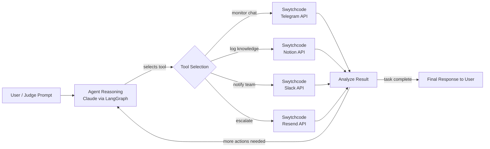

# AI Community Agent — Track 3 (Build with Swytchcode)

An AI agent that monitors community conversations (Telegram), reasons about what
members need, and takes action — logging issues in Notion, notifying the team on
Slack, and escalating via email through Resend — using **LangGraph** for agentic
orchestration and **Swytchcode APIs** for every real-world action.


# Architecture — AI Community Agent (Track 3)



## Flow explanation

1. **User Request** — entered via the web UI (`static/index.html`), e.g. *"Check the
   latest Telegram messages, log any real issues in Notion, and notify the team on
   Slack if anything is urgent."*
2. **Agent Reasoning** — Claude (via the LangGraph `agent` node) reads the request
   and decides the next single action: which Swytchcode-backed tool to call, if any.
3. **Tool Selection & Execution** — the LangGraph `tools` node executes the chosen
   tool against the Swytchcode API (`agent/tools.py`).
4. **Analyze Result** — the tool's result is fed back into the message history.
   Claude re-reasons with this new information — e.g. it only escalates via Slack
   or Resend if the Telegram message it read was actually urgent.
5. **Loop or Finish** — this repeats (bounded by `MAX_STEPS`) until Claude decides
   no further tool calls are needed, at which point it returns a **Final Response**
   summarizing what it did and why.

This is a ReAct-style agent loop (not a fixed pipeline): the model itself decides
*which* tools to use and *in what order*, based on intermediate results — matching
the buildathon's "agent decides which tools to use based on the situation"
requirement.

## Files

| File | Purpose |
|---|---|
| `main.py` | FastAPI app — serves the demo UI and `/api/run` endpoint |
| `agent/graph.py` | LangGraph state graph (reasoning ⇄ tool execution loop) |
| `agent/tools.py` | Swytchcode API wrappers (Telegram, Slack, Notion, Resend) |
| `static/index.html` | Interactive live-demo UI showing each reasoning/tool step |

## Stack

- **Agent framework:** LangGraph (ReAct-style reasoning ⇄ tool-execution loop)
- **LLM:** Groq API
- **Backend:** FastAPI
- **Integrations (Swytchcode APIs):** Telegram, Slack, Notion, Resend

## Setup

1. **Clone & install**
   ```bash
   cd community-agent
   python -m venv venv
   source venv/bin/activate   # Windows: venv\Scripts\activate
   pip install -r requirements.txt
   ```

2. **Configure environment**
   ```bash
   cp .env.example .env
   ```
   Fill in:
  - `GROQ_API_KEY` — your Groq API key
  - `GROQ_MODEL` — optional Groq model ID (defaults to `llama-3.3-70b-versatile`)
   - `SWYTCHCODE_API_BASE` and the four `SWYTCHCODE_*_KEY` values — from the
     Swytchcode dashboard at the event
   - Dummy/test IDs for `TELEGRAM_CHAT_ID`, `SLACK_CHANNEL`, `NOTION_DATABASE_ID`,
     `RESEND_FROM_EMAIL`, `RESEND_TO_EMAIL`

3. **⚠️ Before your first real run — update `agent/tools.py`**
   The endpoint paths (e.g. `/telegram/messages`) are placeholders. Swap them for
   the real Swytchcode endpoints from their docs. Everything else (auth headers,
   error handling, the LangGraph wiring) will keep working unchanged.

4. **Run**
   ```bash
   uvicorn main:app --reload
   ```
   Open **http://localhost:8000** — this is your interactive demo UI.

## Demo script (for the jury round)

Type a prompt like:
> "Check the latest Telegram messages, log any real issues in Notion, and notify
> the team on Slack if anything is urgent."

The UI shows, live:
- the agent's reasoning at each step
- which tool it selected and why
- the Swytchcode API result
- how that result changed its next decision
- the final summary

## Project structure

```
community-agent/
├── main.py                # FastAPI app
├── agent/
│   ├── graph.py            # LangGraph reasoning ⇄ tool-execution loop
│   └── tools.py             # Swytchcode API wrappers
├── static/
│   └── index.html           # Live interactive demo UI
├── requirements.txt
├── .env.example
├── ARCHITECTURE.md
└── README.md
```

## Judging-criteria alignment

- **Swytchcode API integration (30%):** 4 APIs wired in, each contributing to the
  agent's decision flow (not just called in isolation).
- **Technical implementation (25%):** LangGraph state machine with a real
  reasoning ⇄ action loop, not a hardcoded pipeline.
- **Innovation (20%):** agent dynamically decides escalation path (Telegram-only
  reply vs. Notion log vs. Slack/email escalation) based on message content.
- **Functionality (10%):** end-to-end working prototype with a live UI.
- **Real-world impact (10%):** directly solves community-manager triage burden.
- **UX & presentation (5%):** live trace view built for the jury demo.
