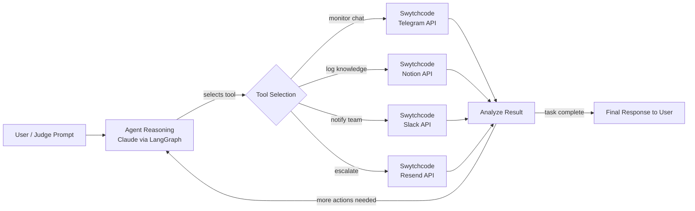

# Architecture — AI Community Agent (Track 3)

## Flow explanation

1. **User Request** — entered via the web UI (`static/index.html`), e.g. *"Check the
   latest Telegram messages, log any real issues in Notion, and notify the team on
   Slack if anything is urgent."*
2. **Agent Reasoning** — Claude (via the LangGraph `agent` node) reads the request
   and decides the next single action: which Swytchcode-backed tool to call, if any.
3. **Tool Selection & Execution** — the LangGraph `tools` node executes the chosen
   tool against the Swytchcode API (`agent/tools.py`).
4. **Analyze Result** — the tool's result is fed back into the message history.
   Claude re-reasons with this new information — e.g. it only escalates via Slack
   or Resend if the Telegram message it read was actually urgent.
5. **Loop or Finish** — this repeats (bounded by `MAX_STEPS`) until Claude decides
   no further tool calls are needed, at which point it returns a **Final Response**
   summarizing what it did and why.

This is a ReAct-style agent loop (not a fixed pipeline): the model itself decides
*which* tools to use and *in what order*, based on intermediate results — matching
the buildathon's "agent decides which tools to use based on the situation"
requirement.

## Files

| File | Purpose |
|---|---|
| `main.py` | FastAPI app — serves the demo UI and `/api/run` endpoint |
| `agent/graph.py` | LangGraph state graph (reasoning ⇄ tool execution loop) |
| `agent/tools.py` | Swytchcode API wrappers (Telegram, Slack, Notion, Resend) |
| `static/index.html` | Interactive live-demo UI showing each reasoning/tool step |
